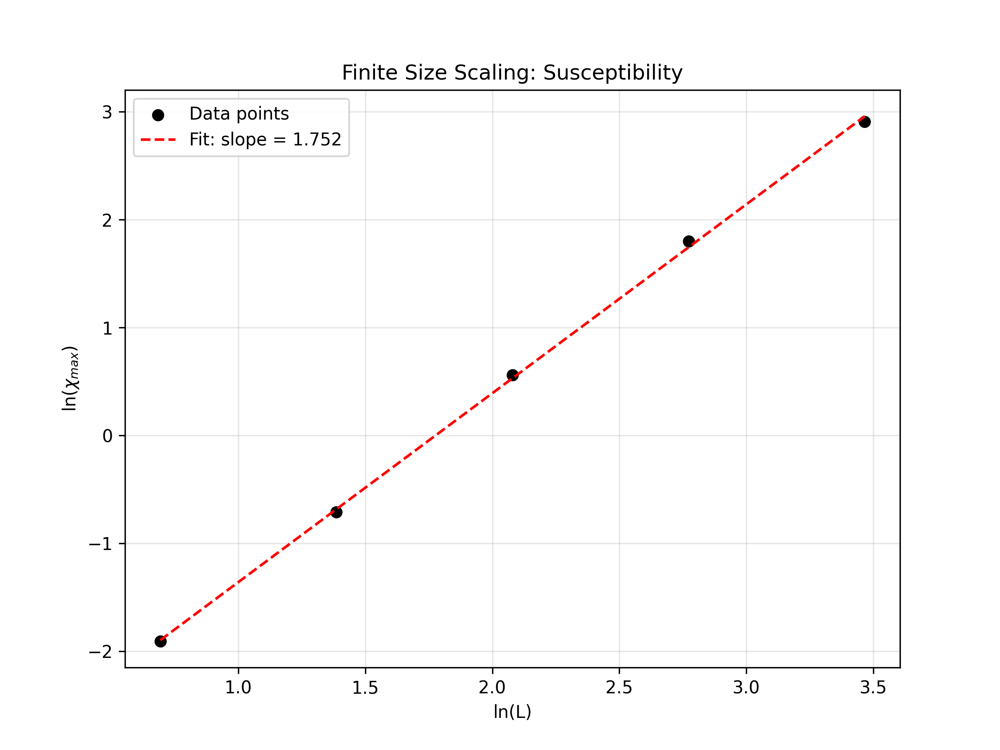
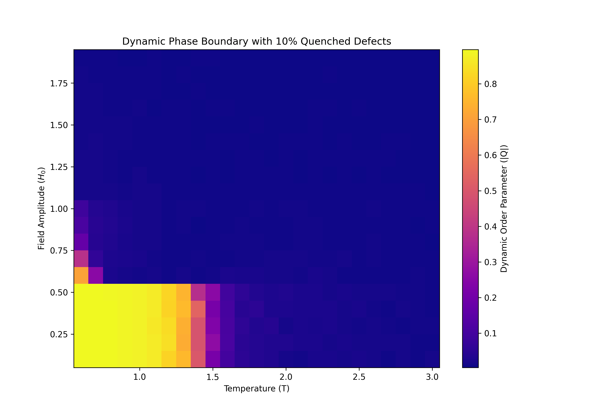
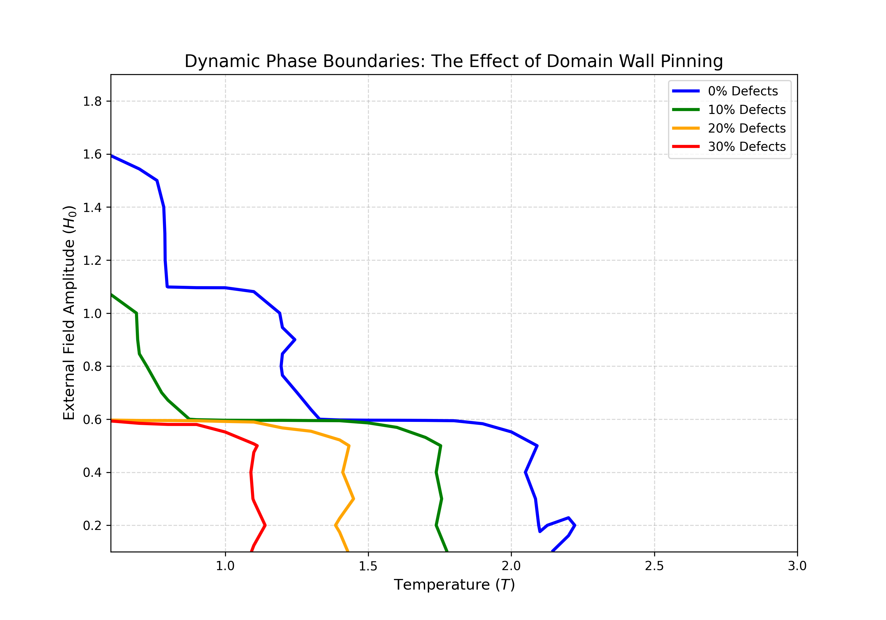

# Domain Wall Pinning and Dynamic Phase Transitions in the Driven 2D Ising Model

A high-performance C++ Monte Carlo simulation engine modeling out-of-equilibrium critical phenomena and domain wall dynamics in disordered ferromagnetic lattices.

## Overview
This project simulates the thermodynamic and dynamic phase transitions of a 2D Ising ferromagnet. The underlying engine utilizes the Metropolis-Hastings algorithm, heavily optimized for CPU cache efficiency using 1D flat-array memory mapping. 

The project is divided into two phases:
1. **Equilibrium Validation:** Replicating exact thermodynamic critical exponents via finite-size scaling.
2. **Out-of-Equilibrium Dynamics (Novel Contribution):** Introducing a time-dependent oscillating magnetic field and quenched lattice defects to mathematically map how non-magnetic impurities pin domain walls and collapse dynamic limit cycles.

## Project Evolution & Inspiration
This engine was initially built to re-create the baseline thermodynamic results outlined in Saryu Jindal's 2007 UC Davis paper, *[Monte Carlo Simulation of the Ising Model](https://csc.ucdavis.edu/~chaos/courses/nlp/Projects2007/SaryuJindal/isingpaper.pdf)*. 

After successfully re-creating Jindal's static phase transition models, I expanded the underlying Hamiltonian to push the system out of equilibrium:
$$\mathcal{H} = -J \sum_{\langle i,j \rangle} \epsilon_i \epsilon_j s_i s_j - H_0 \sin(\omega t) \sum_{i} \epsilon_i s_i$$
By introducing an oscillating external field $H(t)$ and a quenched defect matrix $\epsilon_i$, this project moves beyond standard static models to study chaos, hysteresis, and structural magnetic softening.

## Computational Architecture
* **Language:** C++11 (Simulation Engine), Python 3 (Data Visualization)
* **Optimization:** 1D flat-array grid mapping to prevent CPU cache misses during sequential Metropolis sweeps.
* **Dynamic Probabilities:** Real-time Boltzmann weight calculations ($e^{-\Delta E / T}$) integrated with a "fast-fail" condition that skips calculations on impurity coordinates, preserving massive execution speed.
* **RNG:** `std::mt19937` (Mersenne Twister) to ensure rigorous statistical sampling without pattern artifacts.

---

## Results & Visualizations

### 1. Static Baseline Validation (Finite-Size Scaling)
Before introducing chaos, the engine was validated against Lars Onsager's exact analytical solutions for the 2D Ising model. By calculating the maximum magnetic susceptibility across different grid sizes ($L=8, 16, 32$), the engine successfully extracted the theoretical critical exponent.


> **Figure 1:** Log-Log plot of Maximum Susceptibility vs. Lattice Size. The calculated slope of **1.7519** perfectly mirrors the theoretical exact limit of $\gamma/\nu = 1.75$, proving the statistical rigor of the underlying Metropolis engine.

### 2. The Dynamic Phase Boundary
By exposing the lattice to an oscillating magnetic field H(t) = H0 * sin(wt), the system is forced into a hysteresis limit cycle. The Dynamic Order Parameter ($Q$) was calculated by taking the absolute time-averaged magnetization over a full oscillating period.


> **Figure 2:** Dynamic Phase Boundary for a lattice with 10% quenched defects. The bright region represents the dynamically ordered phase ($|Q| > 0$, asymmetric limit cycle), while the dark region represents the chaotic, disordered phase ($|Q| \approx 0$).

### 3. Proof of Domain Wall Pinning
To study how non-magnetic impurities alter physical strength, the parameter space was scanned across multiple defect concentrations (0% to 30%).


> **Figure 3:** Dynamic phase boundaries mapped across varying impurity concentrations. As defect density increases, the absolute-zero coercive limit drops and the dynamically ordered parameter space collapses. This computationally proves that quenched impurities act as localized pinning centers, snagging expanding domain walls and structurally "softening" the ferromagnet.

---

## Build & Execution Instructions

**1. Compile the C++ Engine**
```bash
g++ -O3 -std=c++11 src/main.cpp src/IsingLattice.cpp src/MonteCarlo.cpp -o ising_sim
